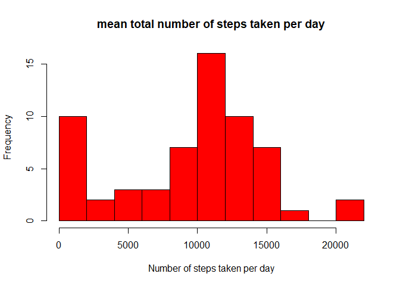
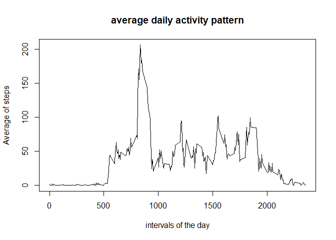
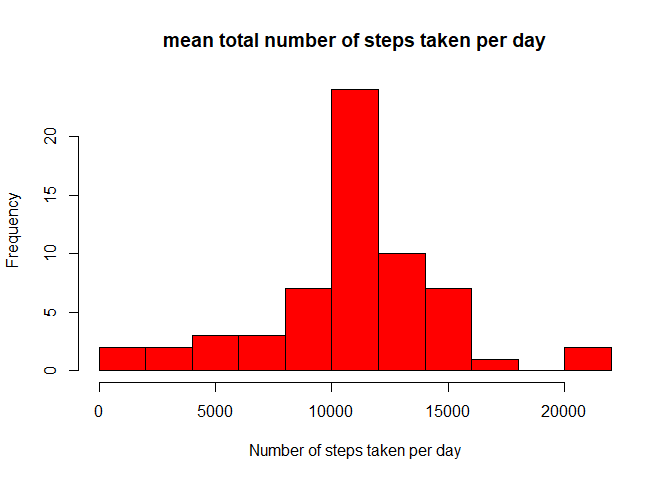
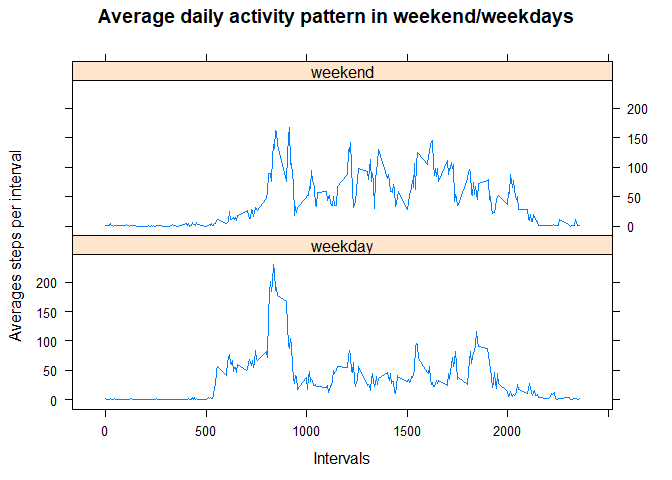

---
title: "Assignment 5.2"
output: html_document
---


###**Loading and preprocessing the data**

Show any code that is needed to:

1. Load the data (i.e. read.csv()\color{red}{\verb|read.csv()|}read.csv())
2. Process/transform the data (if necessary) into a format suitable for your analysis
    

```r
library(dplyr)
library(lubridate)
library(lattice)
```


```r
my_data <-read.csv("activity.csv")
```


###**What is mean total number of steps taken per day?**

For this part of the assignment, you can ignore the missing values in the dataset.

1. Calculate the total number of steps taken per day


```r
my_data1 <- my_data %>% 
        group_by(date) %>%
        summarize(total_steps = sum(steps, na.rm = TRUE)) 
print(head(my_data1))
```

```
## # A tibble: 6 x 2
##   date       total_steps
##   <fct>            <int>
## 1 2012-10-01           0
## 2 2012-10-02         126
## 3 2012-10-03       11352
## 4 2012-10-04       12116
## 5 2012-10-05       13294
## 6 2012-10-06       15420
```

2. If you do not understand the difference between a histogram and a barplot, research the difference between them. Make a histogram of the total number of steps taken each day


```r
hist(my_data1$total_steps, breaks =15, col = "red", xlab = "Number of steps taken per day", main = "mean total number of steps taken per day")
```

<!-- -->

3. Calculate and report the mean and median of the total number of steps taken per day


```r
summary(my_data1$total_steps)
```

```
##    Min. 1st Qu.  Median    Mean 3rd Qu.    Max. 
##       0    6778   10395    9354   12811   21194
```


###**What is the average daily activity pattern?**

1. Make a time series plot (i.e. type = "l"\color{red}{\verb|type = "l"|}type="l") of the 5-minute interval (x-axis) and the average number of steps taken, averaged across all days (y-axis)
        

```r
my_data2 <- my_data %>%
        group_by(interval) %>%
        summarize(average_steps_per_interval= mean(steps, na.rm = TRUE))
plot(my_data2, type = "l", xlab = "intervals of the day", ylab = "Average of steps", main = "average daily activity pattern")
```

<!-- -->


2. Which 5-minute interval, on average across all the days in the dataset, contains the maximum number of steps?
        

```r
summary(my_data2$average_steps_per_interval)
```

```
##    Min. 1st Qu.  Median    Mean 3rd Qu.    Max. 
##   0.000   2.486  34.113  37.383  52.835 206.170
```

```r
filter(my_data2, average_steps_per_interval >206)
```

```
## # A tibble: 1 x 2
##   interval average_steps_per_interval
##      <int>                      <dbl>
## 1      835                       206.
```

So the 835th 5-minute interval contains the maximum of 206 steps on average across all days. 


###**Imputing missing values**

Note that there are a number of days/intervals where there are missing values (coded as NA\color{red}{\verb|NA|}NA). The presence of missing days may introduce bias into some calculations or summaries of the data.

1. Calculate and report the total number of missing values in the dataset (i.e. the total number of rows with NA\color{red}{\verb|NA|}NAs)


```r
nrow(my_data[!complete.cases(my_data),])
```

```
## [1] 2304
```

There are 2304 rows with missing values. 

2. Devise a strategy for filling in all of the missing values in the dataset. The strategy does not need to be sophisticated. For example, you could use the mean/median for that day, or the mean for that 5-minute interval, etc.
Create a new dataset that is equal to the original dataset but with the missing data filled in.


```r
for (i in 1:nrow(my_data)){
        if (!complete.cases(my_data[i,])){
                interval <- my_data$interval[i]
                my_data[i, 1] <- my_data2[my_data2$interval==interval,2]
        }
}
print(head(my_data))
```

```
##       steps       date interval
## 1 1.7169811 2012-10-01        0
## 2 0.3396226 2012-10-01        5
## 3 0.1320755 2012-10-01       10
## 4 0.1509434 2012-10-01       15
## 5 0.0754717 2012-10-01       20
## 6 2.0943396 2012-10-01       25
```


3. Make a histogram of the total number of steps taken each day and Calculate and report the mean and median total number of steps taken per day. Do these values differ from the estimates from the first part of the assignment? What is the impact of imputing missing data on the estimates of the total daily number of steps?


```r
my_data3 <- my_data %>% 
        group_by(date) %>%
        summarize(total_steps = sum(steps, na.rm = TRUE)) 
hist(my_data3$total_steps, breaks =15, col = "red", xlab = "Number of steps taken per day", main = "mean total number of steps taken per day")
```

<!-- -->

```r
summary(my_data3$total_steps)
```

```
##    Min. 1st Qu.  Median    Mean 3rd Qu.    Max. 
##      41    9819   10766   10766   12811   21194
```

The median and mean of the total number of steps taken per day differs from when the missing values are not filled in. The impact of imputing missing data is that the estimates of the total daily number of steps is a better one, because i filled in an average value for the missing values. (The presence of missing days may introduce bias into some calculations or summaries of the data.)

###**Are there differences in activity patterns between weekdays and weekends?**

For this part the weekdays()\color{red}{\verb|weekdays()|}weekdays() function may be of some help here. Use the dataset with the filled-in missing values for this part.

1. Create a new factor variable in the dataset with two levels – “weekday” and “weekend” indicating whether a given date is a weekday or weekend day.


```r
my_data4 <- my_data %>%
        mutate(date = ymd(date), day = wday(date)) %>%
        mutate(weekday = ifelse(day == 1 | day ==7, "weekend", "weekday")) %>%
        mutate(weekday = as.factor(weekday)) %>%
        select(-day)
print(head(my_data4))
```

```
##       steps       date interval weekday
## 1 1.7169811 2012-10-01        0 weekday
## 2 0.3396226 2012-10-01        5 weekday
## 3 0.1320755 2012-10-01       10 weekday
## 4 0.1509434 2012-10-01       15 weekday
## 5 0.0754717 2012-10-01       20 weekday
## 6 2.0943396 2012-10-01       25 weekday
```


2. Make a panel plot containing a time series plot (i.e. type = "l"\color{red}{\verb|type = "l"|}type="l") of the 5-minute interval (x-axis) and the average number of steps taken, averaged across all weekday days or weekend days (y-axis). See the README file in the GitHub repository to see an example of what this plot should look like using simulated data.


```r
my_data5 <- my_data4 %>%
        group_by(weekday, interval) %>%
        summarize(average_steps_per_interval= mean(steps, na.rm = TRUE))
xyplot(average_steps_per_interval~interval | as.factor(weekday), 
       data= my_data5, 
       type = 'l', 
       layout=c(1,2), 
       xlab = "Intervals", 
       ylab = "Averages steps per interval", 
       main = "Average daily activity pattern in weekend/weekdays")
```

<!-- -->
